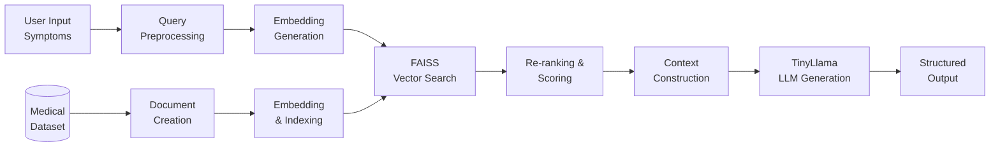

# 🏥 MediRAG - Symptom to Disease Knowledge Assistant

A local AI system that predicts possible diseases based on user-entered symptoms using **Retrieval Augmented Generation (RAG)** with a medical dataset and a locally running open-source LLM.

> ⚠️ **Disclaimer**: This system is for educational purposes only and does not replace professional medical advice.

## 🏗️ Architecture



## 📊 Dataset

The system uses a Kaggle medical dataset containing **~42 diseases** with:
- **Training data**: Symptom-disease associations (binary matrix + named symptoms)
- **Disease descriptions**: Medical descriptions for each disease
- **Precautions**: Recommended precautions per disease (up to 4 each)
- **Symptom severity**: Severity scores (1-7) for 135 symptoms

## 🛠️ Technology Stack

| Component | Technology |
|-----------|------------|
| Language | Python 3.10+ |
| Embeddings | sentence-transformers/all-MiniLM-L6-v2 |
| Vector DB | FAISS (faiss-cpu) |
| Local LLM | TinyLlama/TinyLlama-1.1B-Chat-v1.0 |
| UI | Streamlit |
| ML | scikit-learn, numpy, pandas |

## 📁 Project Structure

```
MediRAG/
├── data/                    # Dataset CSV files
│   ├── Training.csv
│   ├── dataset.csv
│   ├── disease_description.csv
│   ├── disease_precaution.csv
│   └── symptom_severity.csv
├── src/                     # Source modules
│   ├── data_loader.py       # CSV loading utilities
│   ├── preprocessing.py     # Data merging & document creation
│   ├── embeddings.py        # Embedding generation
│   ├── vector_store.py      # FAISS index management
│   ├── retriever.py         # Similarity search & re-ranking
│   ├── llm.py               # Local LLM integration
│   └── rag_pipeline.py      # Full RAG orchestration
├── app/
│   └── app.py               # Streamlit web interface
├── tests/                   # Unit tests
├── requirements.txt
└── README.md
```

## 🚀 Quick Start

### 1. Clone the repository
```bash
git clone https://github.com/Aarjav686/MediRAG.git
cd MediRAG
```

### 2. Create virtual environment
```bash
python -m venv .venv
.venv\Scripts\activate   # Windows
# source .venv/bin/activate  # Linux/Mac
```

### 3. Install dependencies
```bash
pip install -r requirements.txt
```

### 4. Run the application
```bash
streamlit run app/app.py
```

## 💡 Usage

Enter symptoms as text in the input field:
```
fever headache joint pain
```

The system will:
1. **Retrieve** the most relevant diseases from the knowledge base
2. **Rank** them by confidence score
3. **Generate** an AI explanation using the local LLM
4. **Display** precautions and severity information

## 🔧 Features

- ✅ Symptom similarity retrieval using FAISS
- ✅ Disease ranking with confidence scores
- ✅ LLM-powered explanation generation
- ✅ Disease precautions from dataset
- ✅ Severity scoring integration
- ✅ Streamlit web interface
- ✅ Medical disclaimer
- ✅ 100% local execution — no external APIs

## 📝 License

This project is for educational purposes as part of an academic assignment.
