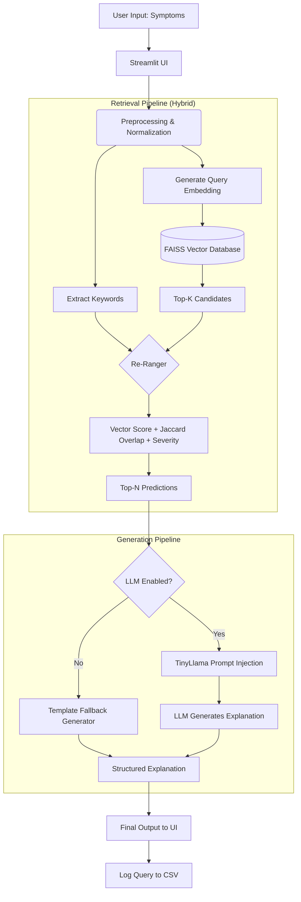

# 🏥 MediRAG: Symptom-to-Disease AI Assistant

**MediRAG** is a local, privacy-first Retrieval-Augmented Generation (RAG) medical assistant. It predicts potential diseases based on user-entered symptoms using a FAISS vector database and optionally generates human-readable explanations using a local HuggingFace LLM (TinyLlama).

  

---

## 🚀 Features

- **Hybrid Retrieval System**: Combines FAISS dense vector similarity with exact symptom keyword overlap for highly accurate disease matching.
- **Severity Scoring**: Automatically calculates Risk Levels (Low, Moderate, High, Critical) based on the severity of matched conditions.
- **Local AI Explanations**: Uses `TinyLlama-1.1B-Chat` entirely locally to summarize conditions and suggest precautions. No external APIs required.
- **Template Fallback Mode**: A lightning-fast, zero-LLM fallback mode that guarantees operation even on low-memory systems.
- **Interactive Streamlit UI**: A clean, modern frontend with confidence tracking, risk alerts, and side-by-side disease comparison tables.
- **Query Logging**: Automatically logs all searches to `logs/query_log.csv` for auditing and future model tuning.

---

## 🏗️ Architecture

Below is the workflow of the MediRAG pipeline:



---

## ⚙️ Installation & Setup

1. **Clone the Repository**
   ```bash
   git clone https://github.com/Aarjav686/MediRAG.git
   cd MediRAG
   ```

2. **Set up a Virtual Environment (Recommended)**
   ```bash
   python -m venv .venv
   # Windows:
   .venv\Scripts\activate
   # Mac/Linux:
   source .venv/bin/activate
   ```

3. **Install Dependencies**
   ```bash
   pip install -r requirements.txt
   ```

4. **Build the Vector Database**
   Before running the app, you need to preprocess the datasets and build the FAISS index:
   ```bash
   python -m src.vector_store
   ```
   *This will generate embeddings for all diseases and save them to the `faiss_index/` directory.*

---

## 🖥️ Running the Application

Launch the Streamlit web interface:

```bash
streamlit run app/app.py
```

The app will open in your default browser at `http://localhost:8501`. 
*Note: The first search might take a moment as the ML models are loaded into memory.*

---

## ⚖️ Disclaimer
**MediRAG is a demonstration tool and does not provide actual medical advice.** All predictions are based on an open-source dataset. If you are experiencing a medical emergency or severe symptoms, please consult a qualified healthcare professional immediately.
